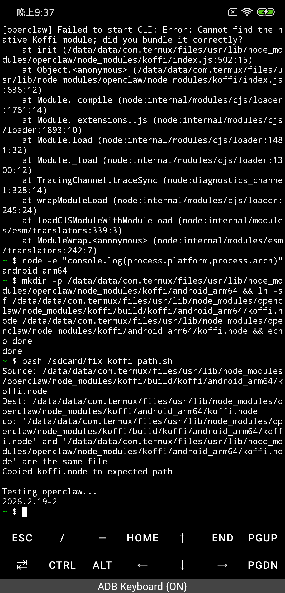
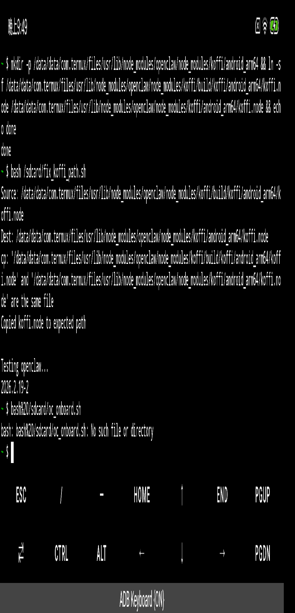
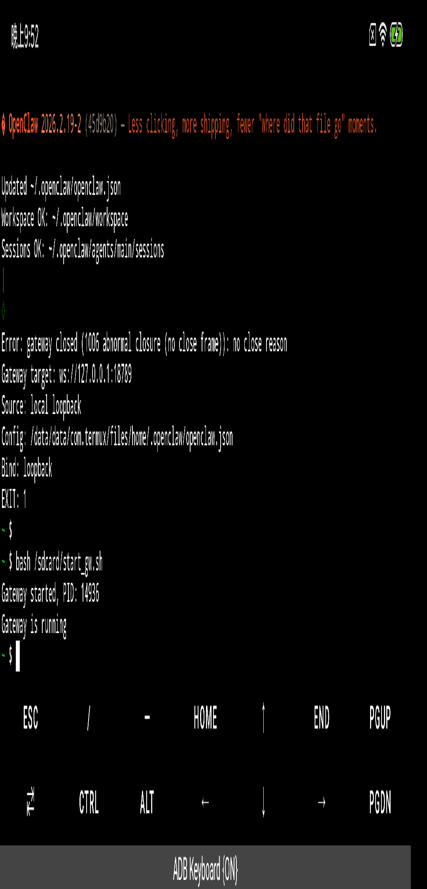
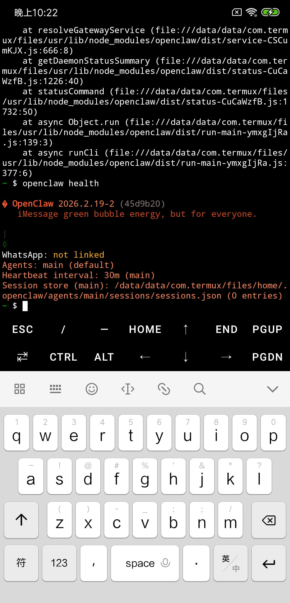
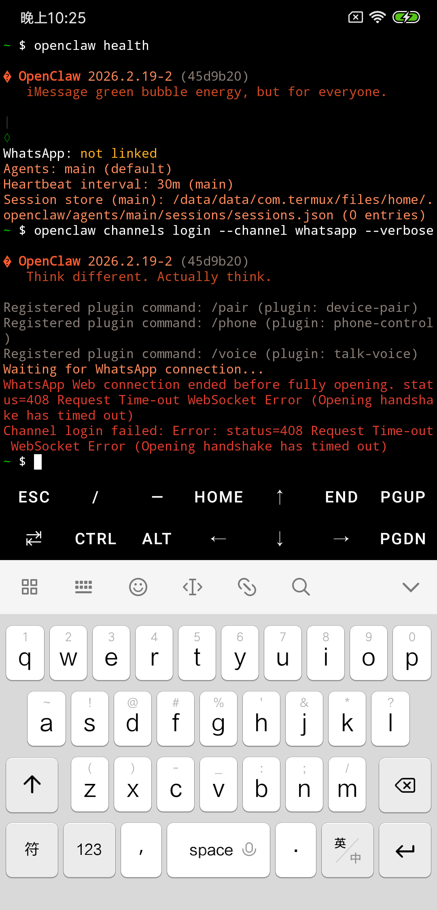
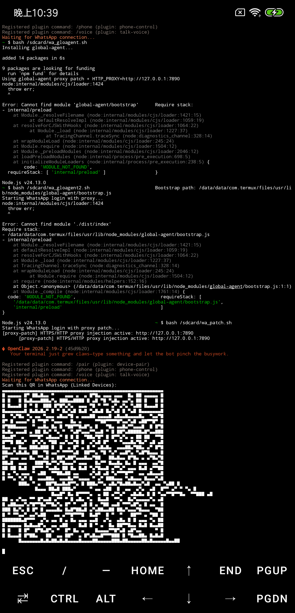
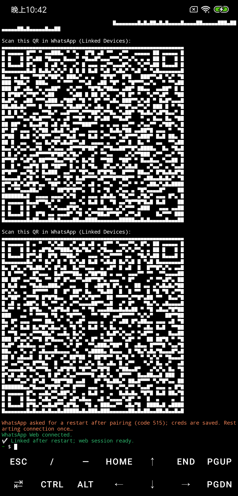

# termux-openclaw-android

**Claude Code Skill** — Install Termux + OpenClaw on Android and connect to WhatsApp (including China/GFW workaround).

Tested on: Xiaomi MI 8 SE · Android · Termux · OpenClaw 2026.2.19-2 · Node.js v24

---

## What This Skill Does

Guides you step-by-step through:

1. **Building** Termux APK from source (Windows + Android SDK)
2. **Installing** Termux on a Xiaomi / Android phone via ADB
3. **Installing OpenClaw** AI gateway in Termux
4. **Fixing koffi** native ARM64 module (recompile from source)
5. **Configuring** OpenClaw with Z.ai GLM models (glm-4.7-flash is free)
6. **Connecting WhatsApp** — including a working GFW bypass via ADB port-forward + Node.js proxy injection

---

## Install as Claude Code Skill

```bash
claude skill install manmonthW/termux-openclaw-android
```

Then invoke with:
```
/termux-openclaw-android
```

---

## Manual Usage

Read [`skill.md`](./skill.md) — it contains all commands and scripts in order.

---

## Key Problem: WhatsApp + GFW

WhatsApp Web is blocked in China. Standard `HTTP_PROXY` environment variables **don't work** for Node.js WebSocket connections. This skill solves it by:

1. **ADB reverse port forwarding** — maps `phone:7890 → PC:7890` (your Clash proxy)
2. **Node.js monkey-patch** (`proxy_patch.js`) — injects `https-proxy-agent` directly into `https.request` at runtime, which the `ws` WebSocket library uses internally for WSS connections

```
Phone (Termux) ──ws──► proxy_patch.js ──https-proxy-agent──► ADB reverse ──► PC Clash:7890 ──► WhatsApp Web
```

---

## Prerequisites

| Requirement | Notes |
|-------------|-------|
| Windows PC | For ADB + APK build |
| Android SDK | platform-tools + build-tools |
| JDK 17 | For Gradle build |
| Clash (or any HTTP proxy) | Running on port 7890, for WhatsApp |
| Z.ai account | https://open.bigmodel.cn — glm-4.7-flash is **free** |
| Android phone | ARM64, tested Xiaomi MI 8 SE |

---

## Screenshots

### OpenClaw running in Termux


### Onboard configuration


### Gateway started


### openclaw health (correct command on Android)


### WhatsApp connection blocked by GFW (before fix)


### QR code appears after proxy injection


### WhatsApp successfully linked


---

## Daily Startup

```cmd
rem On PC:
adb reverse tcp:7890 tcp:7890
```

```bash
# In Termux:
bash ~/start_gw.sh
openclaw health
```

---

## License

MIT
